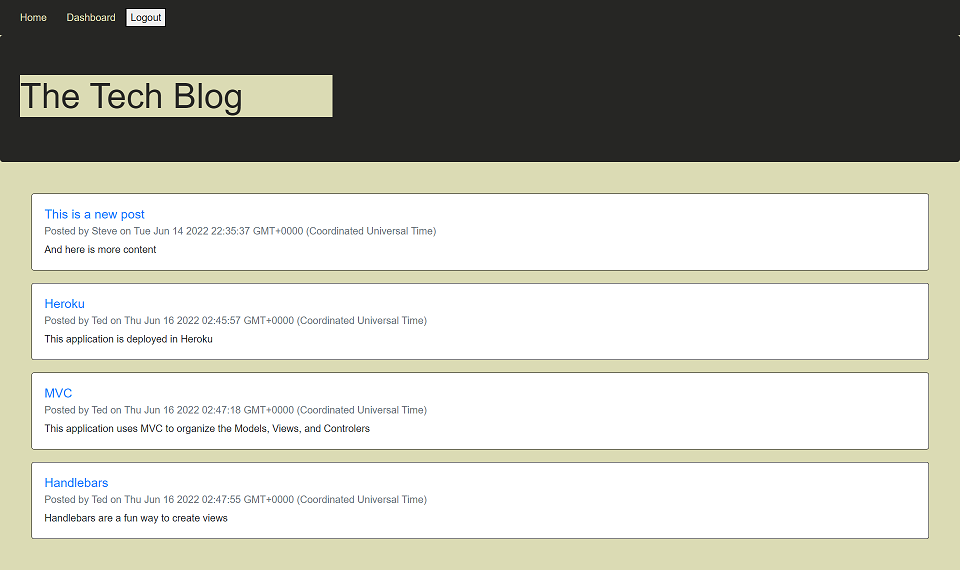

# Tech Blog

## Description

This is a blog application.  The application allows the user to create an account.  Once they have an account and are logged in, they can create blog posts with a title and content.  Users can return to the site via an active session to see their previous blogs they have posted.  Users can also delete their previous blog posts.

There are still two acceptance critera that have not been finished yet.  Users still need to be able to add comments.  And users still need to be able to edit an existing post.

The applicaton runs on a server and is deployed to Heroku.

## Table of Contents

- [Screenshots and Links](#screenshots)
- [Acceptance Criteria](#acceptance)
- [What I Learned](#learned)
- [Credits](#credits)

## ScreenShots

Below is a screenshot of the Tech Blog application in Heroku

The application is live on [Heroku](https://fathomless-wave-42828.herokuapp.com/)

The code is in the [GitHub Repository](https://github.com/stephencurrie/tech-blog)

## Acceptance

The following acceptance criteria were met for the project:

- [x] When I visit the site for the first time, I am presented with the homepage, which includes existing blog posts if any have been posted; navigation links for the homepage and the dashboard; and the option to log in
- [x] When I click on the homepage option, I am taken to the homepage
- [x] When I click on any other links in the navigation, I am prompted to either sign up or sign in
- [x] When I choose to sign up, I am prompted to create a username and password
- [x] When I click on the sign-up button, my user credentials are saved and I am logged into the site
- [x] When I revisit the site at a later time and choose to sign in, I am prompted to enter my username and password
- [x] When I am signed in to the site, I see navigation links for the homepage, the dashboard, and the option to log out
- [x] When I click on the homepage option in the navigation, I am taken to the homepage and presented with existing blog posts that include the post title and the date created
- [x] When I click on the dashboard option in the navigation, I am taken to the dashboard and presented with any blog posts I have already created and the option to add a new blog post
- [x] When I click on the button to add a new blog post, I am prompted to enter both a title and contents for my blog post
- [x] When I click on the button to create a new blog post, the title and contents of my post are saved and I am taken back to an updated dashboard with my new blog post
- [x] When I click on one of my existing posts in the dashboard, I am able to delete or update my post and taken back to an updated dashboard
- [x] When I click on the logout option in the navigation, I am signed out of the site

## Learned

The following is a list of things I learned:

- How to use the MVC paradigm to separate functions and organize your code
- How to create login sessions
- How to create routes on the server
- How to combine front-end javascript with back-end server code
- How to deploy to Heroku with Jaws database

## Credits
I want to thank our instructor Trey Eckels as he provided much needed bug fixing help

I want to thank Simon Rennocks, my tutor, as he provided much needed bug fixing help